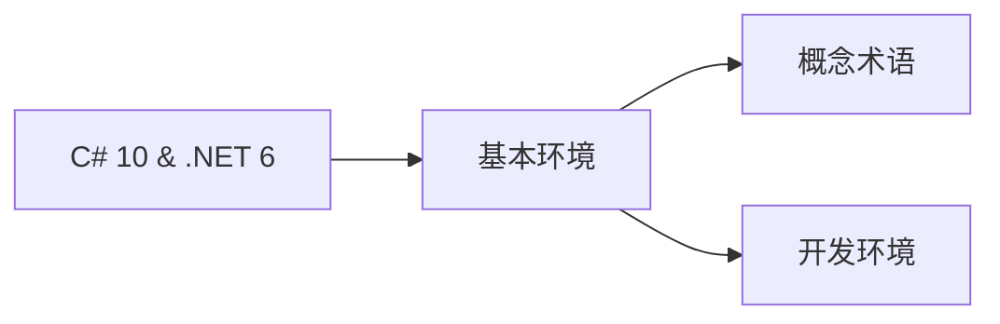

# Modern .NET
.NET Core平台下C#语言开发学习笔记

## 1.  基本环境
### 1.1 概念、术语
`Modern .NET` ：派生自`.NET Core`下的`.NET 5` 和 `.NET 6`等
`Legacy .NET` ：派生自`.NET Framework`下的`.NET`生态

### 1.2 设置开发环境
 VSC要安装的扩展
  - `C# for Visual Studion Code(powered by OmniSharp)`: 语法高亮显示、智能感知等。支持debug、csproj项目
  - `Polyglot Notebooks`
  - `MSBuild project tools` 
  - `REST Client` 发送HTTP request 及查查看响应
  - `ILSpy .NET Decompiler`：反编译MSIL程序集
  - `GitHub Repositories`：
  - `vscode-proto3`：语法高亮、验证、代码完成等。
