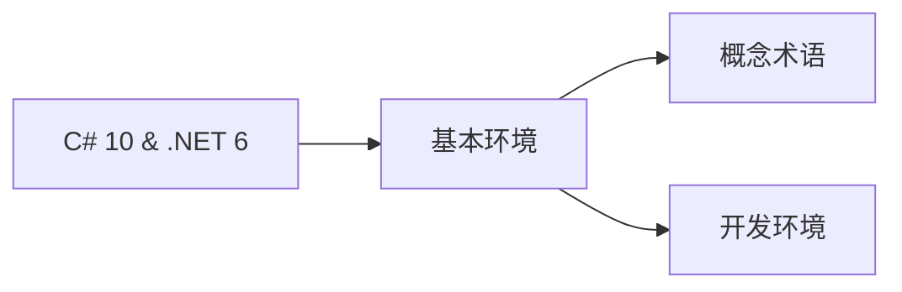

# Modern .NET

.NET Core平台下C#语言开发学习笔记

## 1.  基本环境

### 1.1 概念、术语

`Modern .NET` ：派生自`.NET Core`下的`.NET 5` 和 `.NET 6`等
`Legacy .NET` ：派生自`.NET Framework`下的`.NET`生态

### 1.2 设置开发环境

 VSC要安装的扩展

- `C# for Visual Studion Code(powered by OmniSharp)`: 语法高亮显示、智能感知等。支持debug、csproj项目
- `Polyglot Notebooks`
- `MSBuild project tools` 
- `REST Client` 发送HTTP request 及查查看响应
- `ILSpy .NET Decompiler`：反编译MSIL程序集
- `GitHub Repositories`：
- `vscode-proto3`：语法高亮、验证、代码完成等。

#### 1.2.2 dotnet命令

- `dotnet help 命令` 命令帮助查询，示例：`dotnet help build`

## 2. C#语言

### 2.1 语言版本及其特性

<table>
  <tr><th>C#版本</th><th>新增特性</th><th>特性说明</th></tr>
  <tr><td>1.0 2002</td><td>全部重要特性</td><td>全新面向对象的静态类型语言</td></tr>
  <tr><td rowspan="2">2.0 2005</td><td>null值类型</td><td>允许值为null</td></tr>
  <tr><td>泛型</td><td>提高类型的重用能力</td></tr>
  <tr><td rowspan="2">3.0 2007</td><td>隐式局部变量类型</td><td>可推断局部变量类型</td></tr>
  <tr><td>LINQ</td><td>用于查询操控数据</td></tr>
  <tr><td rowspan="3">4.0 2010</td><td>动态类型</td><td>可处理存储动态类型</td></tr>
  <tr><td>命名实参/可选形参</td><td>可选的形参参数和命名实参</td></tr>
  <tr><td>泛型协变和逆变</td><td></td></tr>
  <tr><td>5.0 2012</td><td>简化异步任务</td><td>async /await</td></tr>
  <tr><td rowspan="3">6.0 2015</td><td>static导入</td><td>简化console用法</td></tr>
  <tr><td>字符串内插(Interpolated strings)</td><td>显示输出给用户</td></tr>
  <tr><td>Expression bodied members</td><td></td></tr>
  <tr><td rowspan="5">7.0 2017.3</td><td>Binar literals and digit separators</td><td>数字完整存储</td></tr>
  <tr><td>模式匹配</td><td>用`if`语句进行模式匹配</td></tr>
  <tr><td>`out`变量</td><td>控制参数传值方式</td></tr>
  <tr><td>元组</td><td>用元组合并多个值</td></tr>
  <tr><td>本地函数</td><td></td></tr>
  <tr><td rowspan="3">7.1 2017.8</td><td>默认字面量表达式</td><td>用默认字面量设置字段</td></tr>
  <tr><td>推断元组元素名称</td><td></td></tr>
  <tr><td>async Main</td><td>提高console应用的表达性</td></tr>
  <tr><td rowspan="4">7.2 2017.11</td><td>数字字面量前导下划线</td><td></td></tr>
  <tr><td>非尾随命名实参</td><td>可选形参和命名实参</td></tr>
  <tr><td>`private protected` 访问修饰符</td><td>允许访问同一程序集中的派生类</td></tr>
  <tr><td>可用`==`、`!=`测试元组类型</td><td>元组比较</td></tr>
  <tr><td>7.3 2018.5</td><td>改善的ref变量、指针、statckalloc</td><td>提供安全代码与不安全代码一样好的性能</td></tr>
  <tr><td rowspan="3">8 2019.9</td><td>可空引用类型</td><td></td></tr>
  <tr><td>switch表达式</td><td></td></tr>
  <tr><td>默认接口方法</td><td></td></tr>
  <tr><td rowspan="4">9 2020.11</td><td>最少代码控制台应用</td><td></td></tr>
  <tr><td>目标类型new表达式</td><td></td></tr>
  <tr><td>模式匹配增强功能</td><td></td></tr>
  <tr><td>记录(Records)</td><td></td></tr>
  <tr><td rowspan="6">10 2021.11</td><td>global using</td><td>全局命名空间导入</td></tr>
  <tr><td>可使用const内插字符串</td><td></td></tr>
  <tr><td>文件范围内的命名空间声明</td><td></td></tr>
  <tr><td>必须属性</td><td></td></tr>
  <tr><td>记录结构</td><td></td></tr>
  <tr><td>空形参检查</td><td></td></tr>
</table>

### 2.3 C#标准

| C# Version | ECMA标准        | ISO/IEC标准          |
| ---------- | ------------- | ------------------ |
| 1.0        | ECMA-334:2003 | ISO/IEC 23270:2003 |
| 2.0        | ECMA-334:2006 | ISO/IEC 23270:2006 |
| 5.0        | ECMA-334:2017 | ISO/IEC 23270:2018 |
| 6及以上       | 草案            | 草案                 |

### 2.4 C#开源

2014年微软开源了C#语言，主要集中在以下三个版本库：

| 描述     | 链接                                       |
| ------ | ---------------------------------------- |
| C#语言设计 | https://github.com/dotnet/csharplang     |
| 编译器实现  | https://github.com/dotnet/roslyn         |
| 语言描述标准 | https://github.com/dotnet/csharpstandard |

### 2.5 C#编译器版本

| .NET SDK | Roslyn 编译器 | 默认C#版本 |
| -------- | ---------- | ------ |
| 1.0.4    | 2.0-2.2    | 7.0    |
| 1.1.4    | 2.3-2.4    | 7.1    |
| 2.1.2    | 2.6-2.7    | 7.2    |
| 2.1.200  | 2.8-2.10   | 7.3    |
| 3.0      | 3.0-3.4    | 8.0    |
| 5.0      | 3.8        | 9.0    |
| 6.0      | 3.9-3.10   | 10.0   |

### 2.4 浏览更多控制台应用
